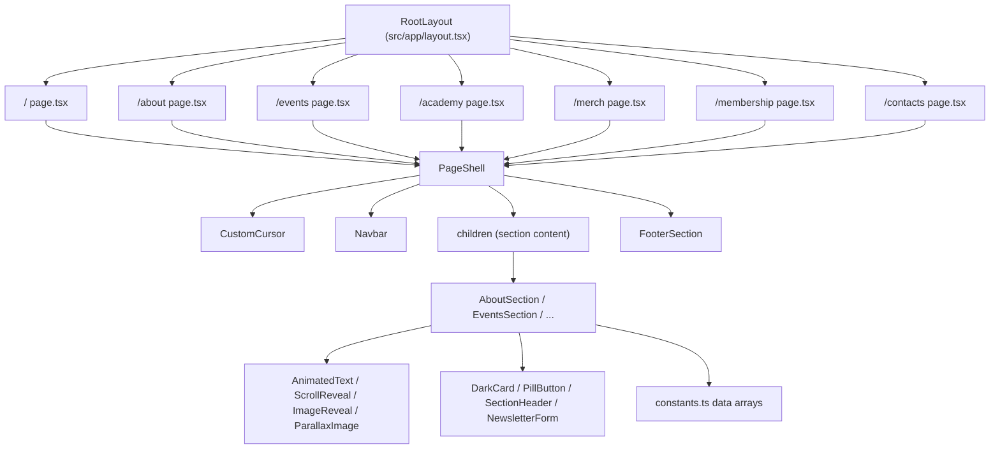
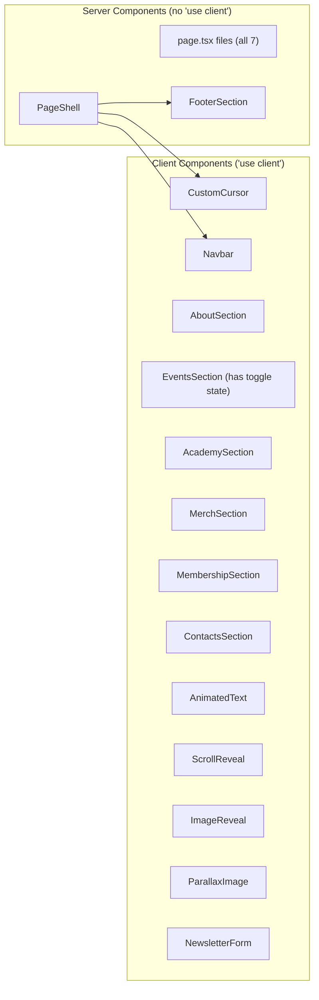

# Design Document — roma-tropicale-pages

## Overview

This feature builds the 6 remaining pages of the Roma Tropicale website (`/about`, `/events`, `/academy`, `/merch`, `/membership`, `/contacts`) as Next.js App Router routes, introduces a shared `PageShell` wrapper, extracts repeated UI patterns into shared components, consolidates hardcoded data into `constants.ts`, and refactors the existing homepage for consistency.

The current codebase has a fully built homepage (`src/app/page.tsx`) that manually composes `CustomCursor`, `Navbar`, landing sections, and `FooterSection`. Six section components already exist in `src/components/sections/` with placeholder content and hardcoded data arrays. These sections were originally designed for a horizontal-scroll layout (they carry `w-screen flex-shrink-0` classes) and need adaptation for standalone vertical page rendering.

The design centralizes layout ownership in `PageShell`, moves all inline data to `constants.ts`, extracts `DarkCard`, `PillButton`, `SectionHeader`, and `NewsletterForm` as shared UI components, and creates 6 new App Router page routes — each a thin server component that imports `PageShell` + its section component.

## Architecture

### High-Level Component Hierarchy



### Server/Client Component Boundaries



**Decision rationale:**
- `PageShell` is a server component — it only composes children and has no hooks/state. It imports `CustomCursor` and `Navbar` (client components) as leaf nodes, which is valid in the App Router model.
- `FooterSection` is already a server component (no `"use client"` directive) that imports and renders `NAV_LINKS` — it stays as-is with no modifications needed (see FooterSection dependency note below).
- All section components remain client components because they use Framer Motion animation primitives (`AnimatedText`, `ScrollReveal`, `ImageReveal`).
- `EventsSection` specifically needs `"use client"` for the HOME/ARCHIVE toggle state (`useState`).
- Page route files (`page.tsx`) are server components — they only import `PageShell`, pass children, and export metadata.

**FooterSection dependency note:** `FooterSection` (at `src/components/landing/FooterSection.tsx`) already imports `NAV_LINKS` from `@/lib/constants` and iterates over it to render footer navigation links. No modification to `FooterSection` is needed — PageShell simply renders it, and the footer links are automatically consistent with `NAV_LINKS`. This is marked as "EXISTING (unchanged)" in the file tree below.

### File Organization

New files to create:

```
src/
├── app/
│   ├── page.tsx                    # MODIFY: refactor to use PageShell
│   ├── about/page.tsx              # NEW
│   ├── events/page.tsx             # NEW
│   ├── academy/page.tsx            # NEW
│   ├── merch/page.tsx              # NEW
│   ├── membership/page.tsx         # NEW
│   └── contacts/page.tsx           # NEW
├── components/
│   ├── layout/
│   │   ├── CustomCursor.tsx        # EXISTING (unchanged)
│   │   └── PageShell.tsx           # NEW
│   ├── ui/
│   │   ├── AnimatedText.tsx        # EXISTING (unchanged)
│   │   ├── ScrollReveal.tsx        # EXISTING (unchanged)
│   │   ├── ImageReveal.tsx         # EXISTING (unchanged)
│   │   ├── ParallaxImage.tsx       # EXISTING (unchanged)
│   │   ├── DarkCard.tsx            # NEW
│   │   ├── PillButton.tsx          # NEW
│   │   ├── SectionHeader.tsx       # NEW
│   │   └── NewsletterForm.tsx      # NEW
│   ├── sections/
│   │   ├── AboutSection.tsx        # MODIFY
│   │   ├── EventsSection.tsx       # MODIFY
│   │   ├── AcademySection.tsx      # MODIFY
│   │   ├── MerchSection.tsx        # MODIFY
│   │   ├── MembershipSection.tsx   # MODIFY
│   │   └── ContactsSection.tsx     # MODIFY
│   └── landing/
│       ├── FooterSection.tsx       # EXISTING (unchanged — already imports NAV_LINKS)
│       ├── Navbar.tsx              # EXISTING (unchanged)
│       ├── HeroSection.tsx         # EXISTING (unchanged)
│       ├── AssetsSection.tsx       # EXISTING (unchanged)
│       ├── HighlightsSection.tsx   # EXISTING (unchanged)
│       └── NewsletterSection.tsx   # EXISTING (unchanged)
└── lib/
    └── constants.ts                # MODIFY: add new data arrays
```

## Components and Interfaces

### PageShell

Location: `src/components/layout/PageShell.tsx`
Type: Server component (no `"use client"`)

```tsx
interface PageShellProps {
  children: React.ReactNode;
}
```

Renders:
```tsx
<main>
  <CustomCursor />
  <Navbar />
  {children}
  <FooterSection />
</main>
```

The homepage (`src/app/page.tsx`) is refactored to:
```tsx
import PageShell from "@/components/layout/PageShell";
// ... landing section imports

export default function Home() {
  return (
    <PageShell>
      <HeroSection />
      <AssetsSection />
      <HighlightsSection />
      <NewsletterSection />
    </PageShell>
  );
}
```

### PillButton

Location: `src/components/ui/PillButton.tsx`
Type: Shared presentational component (no `"use client"` directive)

```tsx
interface PillButtonProps {
  variant?: "primary" | "purple" | "outlined";
  href?: string;
  onClick?: () => void;
  children: React.ReactNode;
  className?: string;
}
```

Behavior:
- When `href` is provided → renders `<Link>` (Next.js) with `rounded-pill` styling
- When `href` is absent → renders `<button>` element
- `variant="primary"` → `bg-roma-dark text-roma-white`
- `variant="purple"` → `bg-roma-purple text-roma-white`
- `variant="outlined"` → `border border-roma-dark text-roma-dark`, hover fills dark
- All variants enforce minimum `h-11` (44px) touch target
- Uppercase text, `text-sm`, `tracking-widest`, `font-medium`

PillButton is a shared presentational component. It does NOT include `"use client"`. When rendered in a server component tree (e.g., as a Link), it works as-is. When interactive usage is needed (onClick handlers), the parent component must be a client component — PillButton itself doesn't need the directive because the client boundary is established by the parent. This is standard React Server Components composition.

### DarkCard

Location: `src/components/ui/DarkCard.tsx`
Type: Server component

```tsx
interface DarkCardProps {
  title?: string;
  description?: string;
  children?: React.ReactNode;
  className?: string;
}
```

Renders a `<div>` with `bg-roma-dark rounded-card p-6 sm:p-8` and optional title (`text-roma-white font-display text-xl sm:text-2xl`), description (`text-roma-white/60 text-sm`), and children slot for custom content (pills, CTAs, forms).

Extracted from the pattern repeated in:
- `ContactsSection` — "Collaborazioni & Partnership" card
- `AboutSection` — partners card
- `ContactsSection` — newsletter mini card
- `LandingSection` — newsletter card

### SectionHeader

Location: `src/components/ui/SectionHeader.tsx`
Type: Client component (`"use client"` — wraps `AnimatedText` and `ScrollReveal`)

```tsx
interface SectionHeaderProps {
  label?: string;
  heading: string;
  as?: "h1" | "h2" | "h3";
  className?: string;
}
```

- `as` controls the HTML heading level rendered by the inner `AnimatedText`. Defaults to `"h1"` for page-level usage.
- Subsection headers (e.g., "Team & Network" in AboutSection, "cosa include il corso" in AcademySection) use `as="h2"` to maintain proper heading hierarchy.
- `label` renders an optional uppercase tracking label via `ScrollReveal` (`text-roma-dark/50 text-sm tracking-widest uppercase`).
- `heading` renders the main heading text via `AnimatedText` at the specified heading level.

Used by: `AboutSection` (`as="h1"` for page heading, `as="h2"` for subsections), `EventsSection`, `AcademySection`, `MerchSection`

### NewsletterForm

Location: `src/components/ui/NewsletterForm.tsx`
Type: Client component (`"use client"` — has `onSubmit` handler)

```tsx
interface NewsletterFormProps {
  variant?: "compact" | "full";
  className?: string;
}
```

- `variant="compact"` → inline row: email input + "GO" button (used in ContactsSection)
- `variant="full"` → centered column: heading, description, email input, "Subscribe" button (used in landing NewsletterSection)
- Both variants use `rounded-pill` inputs and buttons
- Email input has `aria-label="Email"` for accessibility
- Form `onSubmit` prevents default (mock behavior, matching current implementation)

### Section Component Adaptations

All section components in `src/components/sections/` receive these common changes:

1. **Remove horizontal-scroll classes**: Delete `w-screen flex-shrink-0` from the root `<section>`
2. **Standardize padding**: Use `px-6 sm:px-10 lg:px-16 py-16 sm:py-20 lg:py-24` consistently
3. **Remove `overflow-y-auto`**: No longer needed since sections are standalone pages
4. **Import data from constants**: Replace inline arrays with imports from `@/lib/constants`
5. **Use shared components**: Replace inline dark cards, pill buttons, section headers with shared components
6. **Heading hierarchy**: Each section uses exactly one `<h1>` (via `SectionHeader as="h1"` or `AnimatedText as="h1"`), then `<h2>`/`<h3>` for subsections (via `SectionHeader as="h2"` or `AnimatedText as="h2"`)

### Per-Page Section Design

#### AboutSection

```
┌─────────────────────────────────────────────┐
│ SectionHeader: label="About us"             │
│   heading="Siamo una community..." as="h1"  │
├──────────────────┬──────────────────────────┤
│ Brand manifesto  │ Placeholder 3:4          │
│ (long-form text) │ (ImageReveal)            │
├──────────────────┴──────────────────────────┤
│ PillButton row: Events | Academy | Member.  │
├─────────────────────────────────────────────┤
│ SectionHeader: heading="Team & Network"     │
│   as="h2"                                   │
│ 3 team cards (square placeholder + name/role│
├─────────────────────────────────────────────┤
│ DarkCard: "Collaborazioni & Partner"        │
│   partner pills from BRAND.partners         │
└─────────────────────────────────────────────┘
```

- Desktop: 2-column grid (`md:grid-cols-2`) for manifesto + image
- Mobile (<768px): single column stack
- Team: 3 members in `grid-cols-1 sm:grid-cols-3` (reduced from current 6 to match Req 7.4)
- Data: `TEAM_MEMBERS` from constants, `BRAND.partners` (existing)

#### EventsSection

```
┌─────────────────────────────────────────────┐
│ Hero: dark-bg Placeholder 16:7 (desktop)    │
│   16:9 (mobile), italic text overlay        │
│   "stiamo pianificando il prossimo evento"  │
├─────────────────────────────────────────────┤
│ Toggle: [HOME] (filled) [ARCHIVE] (outlined)│
├─────────────────────────────────────────────┤
│ ── Home_View (default) ──                   │
│   Upcoming event hero content               │
│ ── OR ──                                    │
│ ── Archive_View ──                          │
│   "From the archive" label                  │
│   4-col grid of archive event cards         │
│   Each card: colored bg placeholder 3:4     │
│     + date, title, location, description    │
└─────────────────────────────────────────────┘
```

- Toggle is client-side `useState<"home" | "archive">("home")`
- HOME view: shows the hero area with upcoming event content
- ARCHIVE view: shows the archive grid, hides home content
- Archive cards use distinct background colors: `bg-amber-100`, `bg-emerald-100`, `bg-orange-100`, `bg-lime-100` for the poster-style appearance
- Grid: `grid-cols-1 sm:grid-cols-2 lg:grid-cols-4`
- Data: `ARCHIVE_EVENTS` from constants

#### AcademySection

```
┌─────────────────────────────────────────────┐
│ SectionHeader: label="Academy Tropicale"    │
│   heading="learn." as="h1"                  │
│ + orchid placeholder (circular, purple/20)  │
├─────────────────────────────────────────────┤
│ Hero: Placeholder 16:9 + "tera" branding    │
├──────────────────┬──────────────────────────┤
│ "cos'è Academy   │ "Iconic Essentials"      │
│  Tropicale" text │  text + placeholder      │
│  + placeholder   │                          │
├──────────────────┴──────────────────────────┤
│ SectionHeader: heading="cosa include il     │
│   corso" as="h2"                            │
│   course inclusion list                     │
├─────────────────────────────────────────────┤
│ SectionHeader: heading="I nostri Educatori  │
│   Creativi" as="h2"                         │
│   horizontal scroll/wrap: circular          │
│   placeholders + names                      │
└─────────────────────────────────────────────┘
```

- Two content blocks: `grid-cols-1 md:grid-cols-2` on desktop, stacked on mobile
- Educators: `flex flex-wrap gap-6` or horizontal scroll on mobile
- Data: `EDUCATORS` from constants
- "SCOPRI I CORSI" button links to `/contacts` as fallback (Req 16.3)

#### MerchSection

```
┌─────────────────────────────────────────────┐
│ SectionHeader: heading="Il merch di Roma    │
│   Tropicale" as="h1"                        │
│ Descriptive text about limited editions     │
├──────────────────┬──────────────────────────┤
│ Product 1        │ Product 2                │
│ Placeholder 3:4  │ Placeholder 3:4          │
│ name + desc      │ name + desc              │
│ [ORDINA ORA]     │ [ORDINA ORA]             │
├──────────────────┼──────────────────────────┤
│ Product 3        │ Product 4                │
│ Placeholder 3:4  │ Placeholder 3:4          │
│ name + desc      │ name + desc              │
│ [ORDINA ORA]     │ [ORDINA ORA]             │
└──────────────────┴──────────────────────────┘
```

- Grid: `grid-cols-1 sm:grid-cols-2` (2x2 on desktop, single column on mobile)
- 4 products (up from current 3 to fill the 2x2 grid per Req 10.2)
- "ORDINA ORA" buttons link to `/contacts` as fallback (Req 16.3)
- Data: `PRODUCTS` from constants

#### MembershipSection

```
┌──────────────────┬──────────────────────────┐
│ AnimatedText     │ Placeholder 3:4          │
│ as="h1": "Entra  │ (ImageReveal)            │
│ a far parte del  │                          │
│ club!"           │                          │
│                  │                          │
│ Description text │                          │
│                  │                          │
│ Benefits list:   │                          │
│ • benefit 1      │                          │
│ • benefit 2      │                          │
│ • ...            │                          │
│                  │                          │
│ 4€ pricing       │                          │
│                  │                          │
│ [SCOPRI DI PIÙ]  │                          │
└──────────────────┴──────────────────────────┘
```

- Desktop: `flex-col lg:flex-row` split layout
- Mobile (<768px): single column stack
- "SCOPRI DI PIÙ" links to `/contacts` as fallback
- Data: `MEMBERSHIP_BENEFITS` from constants

#### ContactsSection

```
┌──────────────────┬──────────────────────────┐
│ AnimatedText     │ tagline text             │
│ as="h1":         │ purple placeholder 64x96 │
│ "say hi (:"      │                          │
│ email (large)    │                          │
├──────────────────┴──────────────────────────┤
│ DarkCard: "Collaborazioni & Partnership"    │
│   partner pills + CTA                      │
├─────────────────────────────────────────────┤
│ Social icons    │ NewsletterForm (compact)  │
├─────────────────────────────────────────────┤
│ Footer: About | Events | Academy | Contact  │
└─────────────────────────────────────────────┘
```

- Social icons: Instagram, Spotify, LinkedIn with `aria-label` and `BRAND.socials` URLs (see Social Links note below)
- Newsletter uses `NewsletterForm variant="compact"`
- Footer links from `FOOTER_LINKS` constant (4 links — see NAV_LINKS vs FOOTER_LINKS explanation in Data Models)
- Data: `FOOTER_LINKS`, `BRAND.partners`, `BRAND.socials` from constants

### Responsive Breakpoint Strategy

All sections follow the same mobile-first pattern:

| Breakpoint | Width | Behavior |
|-----------|-------|----------|
| Base | <640px | Single column, `px-6`, smaller headings |
| `sm` | ≥640px | 2-column grids where applicable, `px-10`, medium headings |
| `md` | ≥768px | Navbar visible, 2-column content splits |
| `lg` | ≥1024px | Full multi-column grids, `px-16`, large headings |

### Animation Strategy

All animations use the existing primitives — no new animation logic is created:

| Primitive | Usage |
|-----------|-------|
| `AnimatedText` | Page headings (`h1`), section headings (`h2`) — word-by-word staggered reveal |
| `ScrollReveal` | Content blocks, text paragraphs, cards, buttons — directional fade-in |
| `ImageReveal` | Photo placeholders that need the clip-path wipe effect |
| `ParallaxImage` | Decorative images with scroll-driven Y parallax |

All primitives share the easing curve `[0.33, 1, 0.68, 1]` and trigger once (`viewport: { once: true }`).

Staggered reveals in lists use `delay={index * 0.05}` to `delay={index * 0.1}` for sequential card appearance.

### Placeholder Element Patterns

Placeholders are styled `<div>` elements with:
- Defined aspect ratio via Tailwind: `aspect-[3/4]`, `aspect-[16/9]`, `aspect-[16/7]`, `aspect-square`
- Background color from the design system: `bg-roma-bg-alt` (default), `bg-roma-purple/20` (decorative), or colorful poster colors (`bg-amber-100`, `bg-emerald-100`, etc.)
- Rounded corners: `rounded-card` for photos/illustrations, `rounded-full` for person avatars
- Accessibility: `role="img"` and `aria-label` describing what the placeholder represents
- Width constrained by parent grid/flex container — no explicit pixel widths

When replaced with real images in the future, the aspect ratio container ensures zero layout shift — the `<div>` is swapped for `<Image>` inside the same container.

### Events HOME/ARCHIVE Toggle

The toggle is implemented as local React state within `EventsSection`:

```tsx
const [view, setView] = useState<"home" | "archive">("home");
```

- Two `PillButton` components with `onClick` handlers:
  - "HOME" → `variant="primary"` when active, `variant="outlined"` when inactive
  - "ARCHIVE" → `variant="outlined"` when active, `variant="primary"` when inactive
- Conditional rendering: `{view === "home" ? <HomeView /> : <ArchiveView />}`
- No URL change, no router navigation — purely client-side state
- Both views are defined as inline JSX blocks within `EventsSection` (not separate components), keeping the toggle logic self-contained

## Data Models

### Constants Module Additions

All new arrays are added to `src/lib/constants.ts` with `as const` assertions and TypeScript types inferred via `typeof`.

```typescript
// --- NEW EXPORTS ---

export const ARCHIVE_EVENTS = [
  {
    title: "Tropical Night",
    date: "15 Dic 2025",
    location: "The Hoxton, Roma",
    description: "Una serata di musica, cocktail plant-based e connessioni verdi.",
  },
  {
    title: "Green Market",
    date: "28 Nov 2025",
    location: "Trastevere",
    description: "Mercatino di prodotti sostenibili e workshop creativi.",
  },
  {
    title: "Plant Swap",
    date: "10 Ott 2025",
    location: "Pigneto",
    description: "Scambia le tue piante e incontra la community.",
  },
  {
    title: "Rooftop Botanico",
    date: "22 Set 2025",
    location: "W Hotel, Roma",
    description: "Aperitivo panoramico tra piante tropicali.",
  },
] as const;

export type ArchiveEvent = (typeof ARCHIVE_EVENTS)[number];

export const PRODUCTS = [
  { name: "Bucket Hat", description: "Cappello bucket con logo Roma Tropicale ricamato." },
  { name: "Cappello Patch", description: "Baseball cap con patch tropicale in edizione limitata." },
  { name: "T-shirt", description: "T-shirt in cotone organico con grafica tropicale." },
  { name: "Tote Bag", description: "Borsa in tela organica con stampa botanica." },
] as const;

export type Product = (typeof PRODUCTS)[number];

export const EDUCATORS = [
  { name: "Luca R." },
  { name: "Marta B." },
  { name: "Giulia F." },
  { name: "Andrea P." },
  { name: "Sara M." },
  { name: "Davide C." },
  { name: "Elena T." },
  { name: "Marco V." },
] as const;

export type Educator = (typeof EDUCATORS)[number];

export const MEMBERSHIP_BENEFITS = [
  "Accesso prioritario a tutti gli eventi",
  "Sconti esclusivi sul merch",
  "Accesso alla community privata",
  "Workshop mensili gratuiti",
  "Newsletter dedicata con contenuti extra",
] as const;

export const TEAM_MEMBERS = [
  { name: "Member 1", role: "Founder & Creative Director" },
  { name: "Member 2", role: "Community Manager" },
  { name: "Member 3", role: "Events Coordinator" },
] as const;

export type TeamMember = (typeof TEAM_MEMBERS)[number];

export const FOOTER_LINKS = [
  { label: "About", href: "/about" },
  { label: "Events", href: "/events" },
  { label: "Academy", href: "/academy" },
  { label: "Contact", href: "/contacts" },
] as const;

export type FooterLink = (typeof FOOTER_LINKS)[number];
```

### NAV_LINKS vs FOOTER_LINKS — Distinction

Two separate link arrays exist in `constants.ts` for different purposes:

- **`NAV_LINKS`** (6 links: About, Events, Academy, Merch, Membership, Contact): The site-wide navigation links used by `Navbar` and `FooterSection` (the global footer rendered by `PageShell`). These represent the full set of navigable pages.

- **`FOOTER_LINKS`** (4 links: About, Events, Academy, Contact): A smaller subset used specifically in the `ContactsSection`'s own internal footer area. The Contacts page design (see `design/contacts.png`) has a distinct footer element at the bottom of the section content — a horizontal row of 4 links with a different visual layout (smaller text, border-top separator, inline with a mini logo). This is a design-specific element within the section, not the global site footer.

**Why they're separate:** The ContactsSection footer is a visual design element within the page content that shows only 4 links in a specific horizontal spread layout. It's not the global footer (which `PageShell` renders via `FooterSection` with all 6 `NAV_LINKS`). The different count (4 vs 6) and different visual context (section-internal vs global) justify separate arrays. Merging them would force the ContactsSection to render links (Merch, Membership) that don't appear in the design reference.

### Existing Constants (unchanged)

- `SECTIONS` — section IDs and labels
- `BRAND` — name, tagline, email, description, about, socials, partners
- `MARQUEE_ITEMS` — ticker content
- `NAV_LINKS` — 6 navigation links (used by Navbar and FooterSection)
- `HIGHLIGHTS` — highlight card data

### Social Links and BRAND.socials

`BRAND.socials` currently contains placeholder `"#"` values for all three platforms (Instagram, Spotify, LinkedIn). These are external URLs pointing to third-party platforms.

`BRAND.socials` currently contains placeholder `"#"` values for external URLs. These SHALL be replaced with valid external URLs (e.g., `https://instagram.com/romatropicale`) before production. For development, the links render with the current `BRAND.socials` values. This is distinct from internal navigation where `"#"` is never acceptable — external social links may have temporary placeholders that are clearly marked for future replacement.

Social media links in `ContactsSection` use `BRAND.socials.instagram`, `BRAND.socials.spotify`, and `BRAND.socials.linkedin` as their `href` values, satisfying Requirement 16.4. The placeholder nature of these values is a content concern, not a code concern — the code correctly reads from `BRAND.socials`.

### Page Metadata Pattern

Each page route exports a `Metadata` object following this structure:

```typescript
import type { Metadata } from "next";

export const metadata: Metadata = {
  title: "About — Roma Tropicale",
  description: "Scopri chi siamo: una community creativa plant-based radicata a Roma.",
  openGraph: {
    title: "About — Roma Tropicale",
    description: "Scopri chi siamo: una community creativa plant-based radicata a Roma.",
    type: "website",
    locale: "it_IT",
    siteName: "Roma Tropicale",
  },
  alternates: {
    canonical: "/about",
  },
  robots: {
    index: true,
    follow: true,
  },
};
```

Each page has unique `title` and `description` in Italian. The `canonical` URL matches the route path.

## Correctness Properties

*A property is a characteristic or behavior that should hold true across all valid executions of a system — essentially, a formal statement about what the system should do. Properties serve as the bridge between human-readable specifications and machine-verifiable correctness guarantees.*

Each property below is categorized as either **PBT** (true property-based test using fast-check generators with arbitrary inputs) or **Parametric Invariant** (iterates over a known, fixed data set to verify invariants hold for every entry).

### Property 1: PageShell structural invariant [PBT]

*For any* React children passed to PageShell, the rendered output SHALL contain exactly one `<main>` element, and within that `<main>`, CustomCursor and Navbar appear before the children content, and FooterSection appears after the children content.

**Validates: Requirements 1.1, 1.2**

### Property 2: Page metadata completeness [Parametric Invariant]

*For any* page route in the set {about, events, academy, merch, membership, contacts}, the exported `metadata` object SHALL contain: a non-empty `title` string ending with "— Roma Tropicale", a non-empty Italian `description` string, an `openGraph` object with `locale: "it_IT"` and matching title/description, an `alternates.canonical` string matching the route path, and `robots` with `index: true` and `follow: true`.

**Validates: Requirements 3.1, 3.2, 3.3, 3.4, 3.5, 3.6, 3.7**

### Property 3: Constants data shape integrity [Parametric Invariant]

*For any* entry in `ARCHIVE_EVENTS`, it SHALL have non-empty `title`, `date`, `location`, and `description` string fields. *For any* entry in `PRODUCTS`, it SHALL have non-empty `name` and `description` string fields. *For any* entry in `EDUCATORS`, it SHALL have a non-empty `name` string field. *For any* entry in `MEMBERSHIP_BENEFITS`, it SHALL be a non-empty string. *For any* entry in `TEAM_MEMBERS`, it SHALL have non-empty `name` and `role` string fields. *For any* entry in `FOOTER_LINKS`, it SHALL have a non-empty `label` string and an `href` string starting with `/`.

**Validates: Requirements 4.1, 4.2, 4.3, 4.4, 4.5, 4.6**

### Property 4: PillButton variant rendering [PBT]

*For any* PillButton variant in {primary, purple, outlined} and *for any* children content: when `href` is provided, the rendered element SHALL be an anchor (`<a>`) or Next.js `<Link>` with the `rounded-pill` class and minimum height of 44px; when `href` is absent, the rendered element SHALL be a `<button>` with the `rounded-pill` class and minimum height of 44px. The variant SHALL determine the correct background/text color classes: primary → `bg-roma-dark text-roma-white`, purple → `bg-roma-purple text-roma-white`, outlined → `border border-roma-dark text-roma-dark`.

**Validates: Requirements 5.2, 13.5, 15.4, TC-4.2**

### Property 5: DarkCard structural rendering [PBT]

*For any* combination of optional `title`, `description`, and `children` props, DarkCard SHALL render a container with `bg-roma-dark` and `rounded-card` classes. When `title` is provided, it SHALL appear as a heading element with `text-roma-white`. When `description` is provided, it SHALL appear as a paragraph with `text-roma-white/60`. When `children` are provided, they SHALL be rendered inside the container.

**Validates: Requirements 5.1, TC-4.3**

### Property 6: Events toggle state consistency [PBT]

*For any* sequence of toggle activations between "home" and "archive", the EventsSection SHALL display exactly one view at a time: when the last activated toggle is "home", only the Home_View content SHALL be visible; when the last activated toggle is "archive", only the Archive_View content SHALL be visible and it SHALL contain the "From the archive" label.

**Validates: Requirements 8.3, 8.4, 8.5**

### Property 7: Archive event card completeness [Parametric Invariant]

*For any* event in the `ARCHIVE_EVENTS` array, the rendered archive event card SHALL contain: the event's `title`, `date`, `location`, and `description` as visible text elements, a placeholder element with `aspect-[3/4]` class, and a non-white background color class distinct from the default page background.

**Validates: Requirements 8.1.1, 8.1.2, 8.1.5, 8.7**

### Property 8: Merch product card completeness [Parametric Invariant]

*For any* product in the `PRODUCTS` array, the rendered product card SHALL contain: the product's `name` and `description` as visible text, a placeholder element with `aspect-[3/4]` class and a background color, and an "ORDINA ORA" link element with `href="/contacts"`.

**Validates: Requirements 10.4, 10.5, 10.6**

### Property 9: Membership benefits rendering from constants [Parametric Invariant]

*For any* benefit string in the `MEMBERSHIP_BENEFITS` array, the rendered MembershipSection SHALL contain that benefit string as visible text within a list structure.

**Validates: Requirements 11.3, 11.6**

### Property 10: Educator rendering from constants [Parametric Invariant]

*For any* educator in the `EDUCATORS` array, the rendered AcademySection SHALL contain the educator's `name` as visible text alongside a circular placeholder element.

**Validates: Requirements 9.6**

### Property 11: Section component structural invariants [Parametric Invariant]

*For any* section component in {AboutSection, EventsSection, AcademySection, MerchSection, MembershipSection, ContactsSection}, the root element SHALL be a semantic `<section>` element, SHALL NOT have `w-screen` or `flex-shrink-0` classes, and SHALL use the consistent padding pattern `px-6 sm:px-10 lg:px-16`.

**Validates: Requirements 6.1, 6.2, 15.1**

### Property 12: Placeholder element accessibility and dimensions [PBT]

*For any* placeholder element rendered across all section components, the element SHALL have a CSS `aspect-ratio` utility class (matching `aspect-[...]`), a Tailwind background color class, and `role="img"` with a non-empty `aria-label` attribute. Person placeholders (team members, educators) SHALL additionally have `rounded-full` class, and photo/illustration placeholders SHALL have `rounded-card` class.

**Validates: Requirements 15.2, 17.1, 17.2, 17.3, 17.4, 17.5**

### Property 13: Internal link validity [Parametric Invariant]

*For any* internal navigation link rendered across all pages, the `href` value SHALL match one of the valid App Router routes (`/`, `/about`, `/events`, `/academy`, `/merch`, `/membership`, `/contacts`) and SHALL NOT be the placeholder value `"#"`.

**Validates: Requirements 16.1, 16.2**

### Property 14: Social media link accessibility and correctness [Parametric Invariant]

*For any* social media link rendered in the application (Instagram, Spotify, LinkedIn), the element SHALL have a non-empty `aria-label` attribute identifying the platform, and the `href` SHALL match the corresponding value from `BRAND.socials`. Note: `BRAND.socials` currently contains placeholder `"#"` values — this property validates that the code correctly reads from the constant, not that the URLs are valid external links.

**Validates: Requirements 15.5, 16.4**

### Property 15: Single h1 per route [Parametric Invariant]

*For any* route in the set {/, /about, /events, /academy, /merch, /membership, /contacts}, the fully rendered page SHALL contain exactly one `<h1>` element (or element acting as the primary heading).

**Validates: Requirements 3.8, 18.5**

### Property 16: Footer links from NAV_LINKS [Parametric Invariant]

*For any* entry in the `NAV_LINKS` array, the FooterSection rendered by PageShell SHALL contain a link with matching `label` text and `href` value. FooterSection already imports and renders `NAV_LINKS` — this property confirms the existing behavior is preserved.

**Validates: Requirements 16.5**

### Property 17: ContactsSection footer links from FOOTER_LINKS [Parametric Invariant]

*For any* entry in the `FOOTER_LINKS` array, the ContactsSection internal footer area SHALL contain a link with matching `label` text and `href` value.

**Validates: Requirements 12.5**

## Error Handling

### Form Submission

- `NewsletterForm` prevents default form submission (`e.preventDefault()`) — no backend exists. This matches the current mock behavior in `NewsletterSection`.
- No error states are displayed for the newsletter form since there is no submission handler.

### Missing Images / Assets

- All visual content uses placeholder `<div>` elements with CSS background colors, not `` elements. There are no image load failures to handle — the placeholder IS the content for now.
- When real images are added in the future, the aspect-ratio container ensures the layout remains stable even if an image fails to load (the background color shows through).

### Navigation Fallbacks

- CTAs for unimplemented features (e.g., "SCOPRI I CORSI", "ORDINA ORA", "SCOPRI DI PIÙ") link to `/contacts` as a fallback, ensuring visitors always reach a valid page.
- Internal navigation links always use valid App Router routes — `"#"` is never used for internal links.

### Social Media Links

- Social media links use `BRAND.socials` values as their `href`. Currently `BRAND.socials` contains placeholder `"#"` values for all three platforms. These are external links to third-party platforms and are distinct from internal navigation.
- The `"#"` placeholders in `BRAND.socials` are a content gap, not a code defect. The code correctly reads from the constant. These values SHALL be replaced with valid external URLs (e.g., `https://instagram.com/romatropicale`, `https://open.spotify.com/...`, `https://linkedin.com/company/...`) before production deployment.
- This does not contradict Requirement 16.4 ("social media links SHALL use the URLs defined in BRAND.socials") — the links do use `BRAND.socials`. The requirement ensures the code reads from the constant; the content of the constant is a separate concern.

### Client/Server Boundary Errors

- PageShell is a server component that imports client components (`CustomCursor`, `Navbar`) as leaf nodes. This is a valid pattern in Next.js App Router — no serialization boundary issues.
- Section components are client components that import from `constants.ts` (plain data) and UI primitives (client components) — no boundary crossing issues.

### Hydration Safety

- All section components use `"use client"` consistently when they use Framer Motion or React hooks.
- No conditional rendering based on `typeof window` or browser-only APIs that could cause hydration mismatches.
- `CustomCursor` uses `useEffect` for mouse tracking (runs only on client after hydration) — this is already safe.
- The Events toggle uses `useState` with a default value of `"home"` — deterministic initial state, no hydration mismatch.

## Testing Strategy

### Test Categories

This feature uses three distinct test categories for comprehensive coverage:

1. **Property-based tests (true PBT with fast-check generators)**: Tests that generate arbitrary inputs to verify universal properties. These use `fast-check` to create random combinations of inputs and verify that invariants hold across all of them. Examples: PillButton variant × href combinations, DarkCard optional prop combinations, Events toggle state sequences, PageShell with arbitrary children, Placeholder element accessibility across generated content.

2. **Parametric invariant tests (iterate over known data sets)**: Tests that verify invariants across all entries in a known array or all routes. These don't generate random inputs — they iterate over fixed, known data (constants arrays, route lists) and verify that each entry satisfies required properties. Examples: metadata completeness for all 6 routes, constants data shape for all arrays, archive card completeness for all `ARCHIVE_EVENTS`, footer links from `NAV_LINKS`/`FOOTER_LINKS`, single h1 per route, internal link validity.

3. **Unit tests (specific examples and edge cases)**: Traditional tests that verify specific scenarios, integration points, and edge cases with concrete inputs.

### Property-Based Testing Library

**Library**: [fast-check](https://github.com/dubzzz/fast-check) — the standard PBT library for TypeScript/JavaScript.

**Configuration**:
- Minimum 100 iterations per property test (`{ numRuns: 100 }`) — applies to true PBT tests only
- Parametric invariant tests iterate over the full known data set (no numRuns needed)
- Each property test references its design document property via a comment tag
- Tag format: `// Feature: roma-tropicale-pages, Property {number}: {property_text}`

### Test Framework

**Framework**: Vitest (or Jest, whichever is configured) with React Testing Library for component rendering.

- `@testing-library/react` for rendering components and querying the DOM
- `fast-check` for property-based test generation (true PBT tests only)
- Tests run via `vitest --run` (single execution, no watch mode)

### Property Test Plan

Each correctness property maps to a single test. The "Category" column distinguishes true PBT from parametric invariant tests:

| Property | Category | Test Description | Strategy |
|----------|----------|-----------------|----------|
| 1 | PBT | PageShell structure | Generate arbitrary React elements as children via fast-check, render PageShell, verify DOM structure |
| 2 | Parametric Invariant | Metadata completeness | Iterate over all 6 page metadata exports, verify required fields for each |
| 3 | Parametric Invariant | Constants data shape | For each constant array, iterate entries and verify field presence/types |
| 4 | PBT | PillButton variants | Generate all variant × href × children combinations via fast-check, verify element type and classes |
| 5 | PBT | DarkCard rendering | Generate optional title/description/children combinations via fast-check, verify structure |
| 6 | PBT | Events toggle | Generate random sequences of "home"/"archive" clicks via fast-check, verify final visible view |
| 7 | Parametric Invariant | Archive card completeness | For each ARCHIVE_EVENTS entry, verify card contains all required elements |
| 8 | Parametric Invariant | Merch product completeness | For each PRODUCTS entry, verify card contains all required elements |
| 9 | Parametric Invariant | Membership benefits | For each MEMBERSHIP_BENEFITS entry, verify text appears in rendered output |
| 10 | Parametric Invariant | Educator rendering | For each EDUCATORS entry, verify name appears with circular placeholder |
| 11 | Parametric Invariant | Section structural invariants | For each section component, verify root element, classes, and padding |
| 12 | PBT | Placeholder accessibility | Render each section, query all role="img" elements, verify aria-label and aspect-ratio class; use fast-check to generate placeholder content variations |
| 13 | Parametric Invariant | Internal link validity | Render each page, query all internal links, verify href matches valid routes |
| 14 | Parametric Invariant | Social link accessibility | Query social links in ContactsSection, verify aria-label and href from BRAND.socials for each platform |
| 15 | Parametric Invariant | Single h1 per route | For each of the 7 routes, render the page and count h1 elements |
| 16 | Parametric Invariant | Footer links from NAV_LINKS | For each NAV_LINKS entry, verify link exists in FooterSection |
| 17 | Parametric Invariant | ContactsSection footer links | For each FOOTER_LINKS entry, verify link exists in ContactsSection |

### Unit Test Plan

Unit tests cover specific examples, edge cases, and integration points not covered by properties:

- **PageShell**: Homepage refactoring renders correctly with PageShell (Req 1.4)
- **Page routes**: Each of the 6 routes renders its section component (Req 2.1–2.6)
- **SectionHeader**: Renders heading and optional label correctly; `as="h1"` renders h1, `as="h2"` renders h2, default is h1 (Req 5.3)
- **NewsletterForm**: Both compact and full variants render email input and button (Req 5.4)
- **AboutSection**: Displays exactly 3 team members (Req 7.4), manifesto text (Req 7.1), navigation pills to /events, /academy, /membership (Req 7.6)
- **EventsSection**: Hero placeholder with correct aspect ratio (Req 8.1), toggle buttons present (Req 8.2), "From the archive" label in archive view (Req 8.6)
- **AcademySection**: Hero placeholder 16:9 (Req 9.1), two content blocks (Req 9.2), course inclusion list (Req 9.4)
- **MerchSection**: Exactly 4 products rendered (Req 10.2), descriptive text block (Req 10.3)
- **MembershipSection**: Pricing information visible (Req 11.4), "SCOPRI DI PIÙ" button links to /contacts (Req 11.5)
- **ContactsSection**: "say hi (:" heading (Req 12.1), purple placeholder (Req 12.2), DarkCard for partnerships (Req 12.3), NewsletterForm present (Req 12.4), 3 social icons (Req 12.6)
- **Build verification**: TypeScript compiles (Req 18.1), ESLint passes (Req 18.2), `next build` succeeds (Req 18.3)
